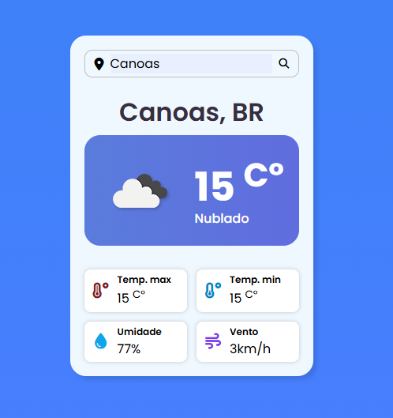

## 🌤️ Previsão do Tempo

Um projeto simples de previsão do tempo onde você pode buscar qualquer cidade e visualizar as principais informações climáticas, como:

- Temperatura atual
- Temperatura máxima e mínima
- Umidade do ar
- Velocidade do vento
- Descrição do clima com ícone ilustrativo

O projeto utiliza a API OpenWeatherMap para obter os dados em tempo real.

---

### 📷 

